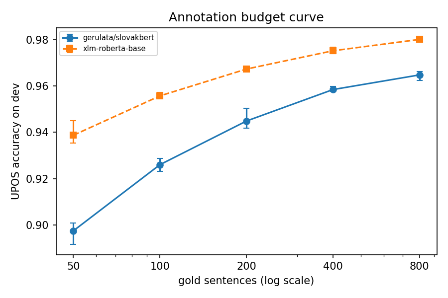
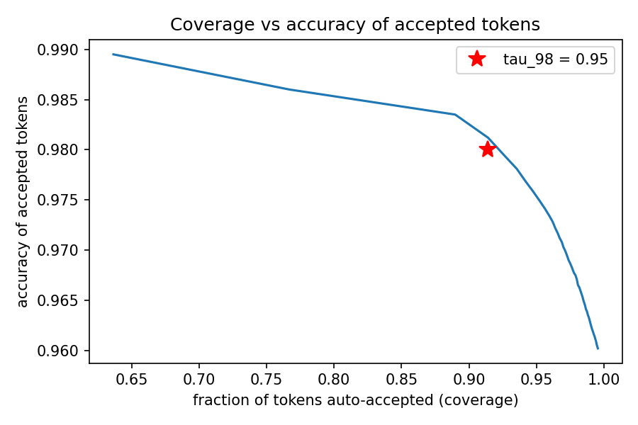

# Milestone 1 (Czech scale study) report: how much annotation does the pipeline need?

*Generated 2026-08-07 from the result files in `results_cs/`. Written for a reader
without a machine-learning background; every technical term is explained where it first appears.*

## Headline

With 400 annotated sentences, the model can tag **91% of all tokens at 98% accuracy or better** (confidence threshold 0.95). A human would only need to review the remaining 9%.

## 1. What was run

We simulated the Sanna situation on Czech, at real scale this time. Czech was chosen because it has
a very large gold-annotated treebank (UD Czech PDT-C; we use a ~100,000-sentence portion) and a
closely related higher-resourced sibling language, Slovak, with a published pretrained model
(SlovakBERT) — mirroring Sanna's relationship to Arabic and CAMeLBERT. We *hid* the tags of almost
the entire corpus and pretended only a small "seed" of sentences was annotated. Unlike the earlier
Maltese pilot (1,123 training sentences), the withheld pool here is ~100,000 sentences, so the
seed-to-pool ratio matches the real Sanna deployment. Czech and Slovak share the Latin script, so
this study isolates the *scale* question; the script/transliteration cost was measured separately
on Maltese.

The tags are **UPOS** tags: the Universal Part-of-Speech inventory (NOUN, VERB, ADJ, and 14 others)
used by the Universal Dependencies project. **Fine-tuning** means continuing the training of a
pretrained neural network briefly on our small annotated seed so it learns to output UPOS tags.
The primary model is **SlovakBERT** (pretrained only on Slovak, the related language — the analogue of using an Arabic model for Sanna). **XLM-RoBERTa base** (pretrained on 100 languages, Czech included) is the comparison baseline; note XLM-R has seen Czech, so it is a *ceiling-ish* reference, like BERTu was for Maltese.

Configurations run, each repeated with 3 different random initialisations ("random seeds"):

- Budget curve: seed sizes 50, 100, 200, 400, 800 sentences (30 training runs).
- Calibration: threshold sweeps at seed size(s) ['200', '400'].
- Self-training: 21 runs.
- One final run for the test-set evaluation.

Total: about **2.2 hours** of measured compute on a free Colab T4 GPU.
Active learning was skipped by instruction.

## 2. Results

### 2.1 Annotation budget curve

Accuracy is the fraction of tokens whose predicted tag matches the human tag, measured on the
dev set (held-out, never trained on).

| Model | Gold sentences | Mean accuracy | Min | Max |
|---|---|---|---|---|
| gerulata/slovakbert | 50 | 0.8974 | 0.8916 | 0.9009 |
| gerulata/slovakbert | 100 | 0.9260 | 0.9232 | 0.9287 |
| gerulata/slovakbert | 200 | 0.9449 | 0.9418 | 0.9503 |
| gerulata/slovakbert | 400 | 0.9585 | 0.9577 | 0.9599 |
| gerulata/slovakbert | 800 | 0.9648 | 0.9625 | 0.9662 |
| xlm-roberta-base | 50 | 0.9387 | 0.9354 | 0.9451 |
| xlm-roberta-base | 100 | 0.9557 | 0.9549 | 0.9572 |
| xlm-roberta-base | 200 | 0.9673 | 0.9662 | 0.9686 |
| xlm-roberta-base | 400 | 0.9752 | 0.9740 | 0.9768 |
| xlm-roberta-base | 800 | 0.9801 | 0.9793 | 0.9807 |

The chosen seed size for later stages was **400** — the smallest size whose mean accuracy comes
within 1 point of the best observed for the primary model.

### 2.2 Calibration and auto-accept coverage

For each tagged token the model outputs a **confidence** — its own probability that the tag is
right. If confidences are trustworthy, we can auto-accept every token above a threshold and only
send the rest to a human. Sweeping thresholds from 0.50 to 0.99 at seed size 400:
the lowest confidence threshold whose accepted tokens are at least 98% correct is **tau_98 = 0.95**, and **91.4%** of dev tokens clear it.

The reliability diagram (`calibration.png`) shows whether tokens the model calls e.g. 90% certain
are actually right 90% of the time; points below the diagonal mean over-confidence.

### 2.3 Self-training

**Self-training** uses the model's own high-confidence predictions on unannotated text as extra
("silver") training data: tag the unlabelled pool, keep tokens above the per-size threshold,
retrain from the original pretrained checkpoint on gold + accumulated silver, repeat.
Round 0 is the gold-only baseline.

**Seed size 200:**

| Round | Runs | Mean silver tokens | Mean dev accuracy |
|---|---|---|---|
| 0 | 3 | 0 | 0.9449 |
| 1 | 3 | 134913 | 0.9193 |
| 2 | 3 | 142299 | 0.9051 |

**Seed size 400:**

| Round | Runs | Mean silver tokens | Mean dev accuracy |
|---|---|---|---|
| 0 | 3 | 0 | 0.9585 |
| 1 | 3 | 184084 | 0.9605 |
| 2 | 3 | 191719 | 0.9617 |
| 3 | 3 | 193988 | 0.9621 |

- At seed size 200: did not meaningfully help — round-0 baseline 0.9449, best round (0) 0.9449, change +0.0000.
- At seed size 400: helped — round-0 baseline 0.9585, best round (3) 0.9621, change +0.0037.

### 2.4 Final test-set result

The single best configuration by dev accuracy — xlm-roberta-base, 800 gold sentences, random seed 1 — was retrained once and evaluated once
on the frozen test set (untouched until this step):

**Test UPOS accuracy: 0.9759**

## 3. What worked

- Fine-tuning on tiny seeds: 0.897 mean accuracy from 50 sentences,
  0.945 at 200, 0.965 at 800 (gerulata/slovakbert).
- Auto-accepting at tau_98 = 0.95 covers 91.4% of tokens at >=98% accuracy.
- At seed size 200: did not meaningfully help — round-0 baseline 0.9449, best round (0) 0.9449, change +0.0000.
- At seed size 400: helped — round-0 baseline 0.9585, best round (3) 0.9621, change +0.0037.

## 4. What went wrong / deviations

Logged automatically during the runs, verbatim:

- `2026-08-07 08:21:22 04: early stop for size=200 rs=0 after round 2`
- `2026-08-07 08:33:35 04: early stop for size=200 rs=1 after round 2`
- `2026-08-07 08:45:43 04: early stop for size=200 rs=2 after round 2`

Deviations and honesty items:

- **The unlabelled pool for self-training was capped at 10,000 sentences** (a fixed random
  subsample of the ~100k withheld sentences, per random seed) to keep each round's tagging and
  retraining inside a free Colab session. Coverage numbers are computed on the dev set, not the
  capped pool.
- **Dev evaluations use a fixed 3,000-sentence subsample** of the (very large) PDT-C dev split;
  the final test evaluation uses the full frozen test split.
- **Only three PDT-C training sections (lt, la, ca) were used** (~100k sentences), not the full
  treebank; genre composition therefore differs from full PDT-C.
- **No transliteration step in this study** — Czech and Slovak share the Latin script. Scale and
  script were deliberately separated: script cost was measured on Maltese, scale is measured here.
- Silver labels from later self-training rounds overwrite earlier ones for the same token when
  rounds disagree; the accumulation rule in the spec did not define this case.

## 5. Threats to validity

- Gold treebanks are clean and consistently annotated; the Sanna corpus will not be. All numbers
  are optimistic bounds, not predictions.
- Seed size and thresholds were chosen on the dev set; only the final test number is free of that
  mild optimism.
- One test evaluation of one configuration — the test number has no error bar.
- Trained models are discarded after each run; GPU retraining is not bit-for-bit reproducible.
- Czech/Slovak are closer relatives than Sanna/Arabic may be; transfer from SlovakBERT is likely easier than the Sanna case.

## 6. Open questions for the next session

- Combine the two measured effects: does self-training still behave the same *after* lossy
  transliteration (the Maltese condition) at Czech scale? That is the full Sanna condition.
- Active learning (uncertainty-ordered review queue) remains untested.
- Does temperature scaling (a one-parameter calibration fix) raise coverage at tau_98?
- Would continued pretraining of SlovakBERT on raw Czech close the gap to XLM-R?
- Replicate on a second pair (e.g. Russian treebank + Ukrainian model) to check pair-specificity.
