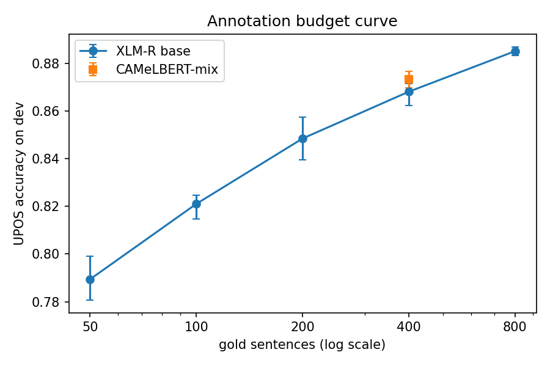
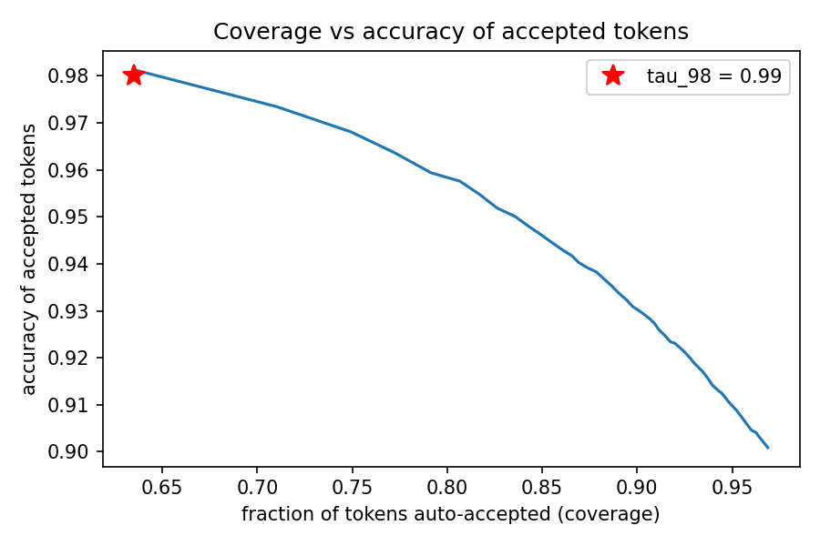

# Milestone 1 report: how much annotation does the pipeline need?

*Generated 2026-08-05 from the result files in `results/`. Written for a reader
without a machine-learning background; every technical term is explained where it first appears.*

## Headline

With 800 annotated sentences, the model can tag **64% of all tokens at 98% accuracy or better** (confidence threshold 0.99). A human would only need to review the remaining 36%.

## 1. What was run

We simulated the Sanna situation on Maltese: the MUDT treebank (a corpus of Maltese sentences where
every word already has a human-verified part-of-speech tag) was transliterated in full into Arabic
script, and we then *hid* most of its tags and pretended only a small "seed" of sentences was
annotated. Because the hidden tags still exist, we can measure exactly how well the system recovers
them — something impossible on a genuinely unannotated corpus.

The tags are **UPOS** tags: the Universal Part-of-Speech inventory (NOUN, VERB, ADJ, and 14 others)
used by the Universal Dependencies project. The model is **XLM-RoBERTa base**, a neural network
pre-trained on text in 100 languages, which we **fine-tune**: continue training it briefly on our
small annotated seed so it learns to output UPOS tags. As a comparison point closer to the Sanna
case, **CAMeLBERT-mix** (a model pre-trained on Arabic, including dialects) was run at seed size 400.

Configurations run, each repeated with 3 different random initialisations ("random seeds") because
results vary run-to-run at small data sizes:

- Budget curve: seed sizes 50, 100, 200, 400, 800 sentences (18 training runs total,
  including CAMeLBERT at size 400).
- Calibration: one further run at the chosen seed size (800).
- Self-training: 12 runs (up to 4 rounds x 3 seeds).
- One final run for the test-set evaluation.

Total: 32 training runs, about **0.8 hours** of measured compute on a free
Colab T4 GPU. Active learning (planned step 5) was skipped by instruction.

## 2. Results

### 2.1 Annotation budget curve

Accuracy is the fraction of tokens (words) whose predicted tag matches the human tag, measured on
the *dev set* — a held-out portion of the treebank never used for training.

| Model | Gold sentences | Mean accuracy | Min | Max |
|---|---|---|---|---|
| CAMeL-Lab/bert-base-arabic-camelbert-mix | 400 | 0.8733 | 0.8698 | 0.8768 |
| xlm-roberta-base | 50 | 0.7894 | 0.7807 | 0.7991 |
| xlm-roberta-base | 100 | 0.8211 | 0.8147 | 0.8248 |
| xlm-roberta-base | 200 | 0.8485 | 0.8395 | 0.8576 |
| xlm-roberta-base | 400 | 0.8682 | 0.8624 | 0.8715 |
| xlm-roberta-base | 800 | 0.8852 | 0.8833 | 0.8870 |

The chosen seed size for all later stages was **800** — the smallest size whose mean accuracy
comes within 1 point of the best observed, i.e. where the curve begins to plateau.

### 2.2 Calibration and auto-accept coverage

For each tagged token the model also outputs a **confidence** — its own probability that the tag is
right. If confidences are trustworthy ("calibrated"), we can auto-accept every token above a
threshold and only send the rest to a human. Sweeping thresholds from 0.50 to 0.99:
the lowest confidence threshold whose accepted tokens are at least 98% correct is **tau_98 = 0.99**, and **63.5%** of dev tokens clear it.

**Coverage** means: of all tokens in the dev set, the fraction whose confidence clears the
threshold and is therefore accepted without review.

The reliability diagram (`calibration.png`) shows, for 10 bins of confidence, whether tokens the
model calls e.g. 90% certain are actually right 90% of the time; points below the diagonal mean
over-confidence.

### 2.3 Self-training

**Self-training** uses the model's own high-confidence predictions on unannotated text as extra
("silver") training data: tag the unlabelled pool, keep tokens above the threshold, retrain from
the original pre-trained checkpoint on gold + silver, repeat. Round 0 is the gold-only baseline.

| Round | Runs | Mean silver tokens | Mean dev accuracy |
|---|---|---|---|
| 0 | 3 | 0 | 0.8868 |
| 1 | 3 | 4155 | 0.8861 |
| 2 | 3 | 4441 | 0.8845 |
| 3 | 3 | 4540 | 0.8867 |

Mean dev accuracy moved from 0.8868 (round 0) to 0.8868 at its best round
(round 0), a change of +0.0000.

### 2.4 Final test-set result

The single best configuration by dev accuracy — xlm-roberta-base, 800 gold sentences, random seed 2, self-training round 3 — was retrained once and evaluated once
on the frozen test set (untouched until this step, so this number is an honest estimate):

**Test UPOS accuracy: 0.9033**

## 3. What worked

- Fine-tuning on tiny seeds works at all: 0.789 mean accuracy from just 50 sentences, rising to 0.885 at 800.
- The budget curve flattens by 800 sentences: beyond that, each extra annotated sentence buys
  little dev accuracy. That is the practically-sized annotation ask for David.
- Auto-accepting at tau_98 = 0.99 covers 63.5% of tokens at >=98% accuracy — the headline pipeline property.
- Self-training did not meaningfully help: +0.0000 mean accuracy versus the gold-only baseline. Per the ablation-ladder rule, it is a candidate for cutting from the Sanna pipeline.

## 4. What went wrong

Everything logged automatically during the runs, verbatim:

- (no runtime problems were logged)

Deviations from the original plan and other honesty items:

- **Transliteration is the deterministic variant, not the paper's full pipeline.** The MLRS
  (2024 EACL) non-deterministic transliteration needs ranking language models hosted in an external
  Google Drive folder whose download quota was exhausted; the deterministic character mapping was
  used instead for the whole corpus (decided and documented before this study, see
  `STEP_1A_RESULTS.md`). All numbers here are for that variant.
- **Threshold and seed size were chosen on the dev set**, the same set used to report dev accuracy.
  Only the final test number is free of this mild optimism.
- **Trained models are deliberately discarded** after each run (Drive space); reproducing a row
  means retraining, which on a GPU is not bit-for-bit deterministic — expect small differences.
- **Active learning (step 5 of the original plan) was skipped entirely** by instruction, so this
  study says nothing about whether an uncertainty-ordered review queue beats corpus-order
  annotation.
- Silver labels from later self-training rounds overwrite earlier ones for the same token when the
  rounds disagree; the accumulation rule in the spec did not define this case.

## 5. Threats to validity

- **MUDT is a clean, curated treebank** with standardised spelling and consistent annotation. The
  Sanna corpus is none of those things. Every number above is an optimistic bound, not a prediction.
- **Maltese is not Sanna.** The transliteration quality, the tag distribution, and the match to
  CAMeLBERT's pre-training data will all differ.
- **One test evaluation of one configuration** — the test number has no error bar.
- **Dev-set reuse**: seed size and threshold were tuned on the same dev set that produced the curves,
  so dev numbers are slightly flattered; coverage at tau_98 on truly new text may be a little lower.
- **Sentence-length truncation**: sentences longer than 256 subword pieces are cut off (a handful of
  tokens at most); their tail tokens are neither trained on nor evaluated.

## 6. Open questions for the next session

- Does an uncertainty-based review queue (active learning) beat random annotation order? Skipped
  here; it is the remaining unanswered question from the original plan.
- Would continued pre-training on raw transliterated Maltese (plan stage S1) lift the small-seed end
  of the budget curve?
- The error-asymmetry probe (transliterate-vs-leave for unclassifiable tokens) remains unrun.
- Is CAMeLBERT's gap to XLM-R at seed 400 stable across seed sizes? Only 400 was tested.
- How much does coverage at tau_98 drop on out-of-domain text? MUDT's genre mix is narrow.
